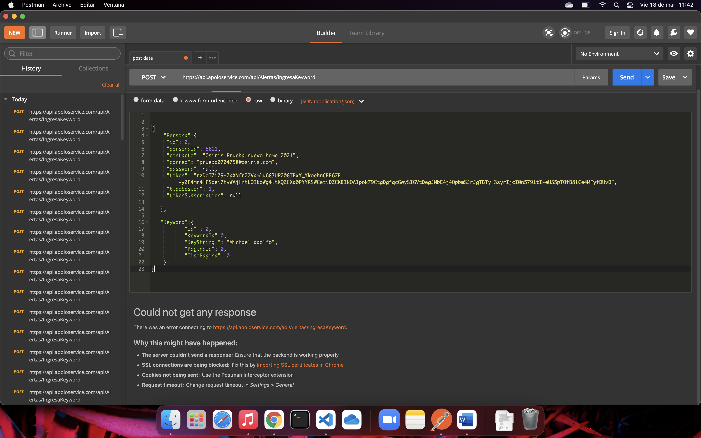

# Prueba Tecnica Apolo - Michael Adolfo Huerta Ramirez

[Live server - probar la aplicacion](https://dreamy-lovelace-0a4136.netlify.app/)

## Instalacion

Instalar [node.js](https://nodejs.org/es/) en su computadora

Recomiendo usar [Visual Studio Code](https://code.visualstudio.com/)


Despues Instalar las dependencias del proyecto entrar ala carpeta raiz del proyecto y correr el siguiente comando

(Es en donde se encuentra el archivo package.json)
```bash
npm i 
```
## Uso

```javascript
//correr en desarrrollo
npm run dev
```
Primer endpoint
```javascript
    https://prueba-apolo-adolfo.herokuapp.com/api/getToken/
```
Segunda endpoint


```javascript
  https://prueba-apolo-adolfo.herokuapp.com/api/getKeyWords
```

Tercera Endpoint




Michael Adolfo Huerta Ramirez - [Club Desarrollo Web](https://www.facebook.com/DWESCOM)


## License
[MIT](https://choosealicense.com/licenses/mit/)

